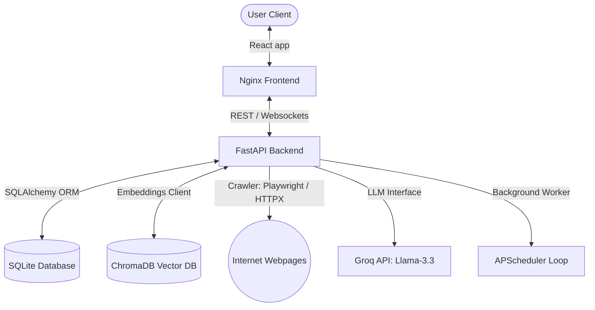

# WebRAG – Ask a Set of Web Pages

WebRAG is a production-quality, Retrieval-Augmented Generation (RAG) platform that crawls target websites, cleans their content, chunks and indexes them into a vector database (ChromaDB), and answers questions grounded strictly in that content using Groq's high-speed LLM service.

---

## Features

- **Dynamic Crawling & JS Support**: Standard web scrapers with automatic headless browser fallback (Playwright) for JS-heavy client apps.
- **Content Freshness & Change Detection**: Calculates content SHA-256 hashes on refreshes to detect changes, generates line-by-line diff reports using `difflib`, and updates vector namespaces incrementally.
- **WebSocket Logs**: Live streaming of scraping and vector indexing activities.
- **Conversational Memory**: Maintains grounded chat histories.
- **Settings Dashboard**: Configurable crawl depth, page count limit, split sizes, and similarity search parameters.

---

## Folder Explanation

```text
backend/
├── config/             # Config layer loading dotenv settings
├── database/           # SQLite schema declarations & session generators
├── crawler/            # Async Crawler using HTTPX and Playwright rendering
├── parser/             # Noise cleanup BeautifulSoup parser and char splitter
├── embeddings/         # Local sentence-transformers embeddings cached loader
├── rag/                # ChromaDB vector store wrapper and LangChain ChatGroq chain
├── scheduler/          # Background scheduler executing freshness checks (APScheduler)
├── services/           # Content diff calculators and index executors
├── schemas/            # Pydantic request & response model schemas
├── tests/              # Pytest unit testing suite
├── main.py             # FastAPI REST controller and WS router
├── requirements.txt    # Locked python package dependencies
└── Dockerfile          # Python image builder with browser drivers

frontend/
├── src/
│   ├── api/            # Axios API service client
│   ├── components/     # UI layouts (e.g. sidebar navigation, dialog modals)
│   ├── pages/          # React views: Dashboard, Collections, Chat, Search, Settings
│   ├── index.css       # Custom styles
│   ├── App.jsx         # App router entries
│   └── main.jsx        # App startup mounting
├── tailwind.config.js  # Styling themes configurations
├── postcss.config.js   # Style compiler config
├── Dockerfile          # Nginx static server container build file
└── package.json        # Node modules packages list
```

---

## Architecture Diagram



---

## Installation & Setup

### Option 1: Docker Compose (Recommended)

To run the entire stack inside containers:

1. Create a `.env` file at the root containing your Groq API key:
   ```env
   GROQ_API_KEY=your_key_here
   ```
2. Build and launch services:
   ```bash
   docker-compose up --build
   ```
3. Open `http://localhost` in your browser.

### Option 2: Local Manual Launch

#### 1. Backend Setup

1. Initialize a Python virtual environment:
   ```bash
   python -m venv venv
   source venv/bin/activate  # On Windows: .\venv\Scripts\activate
   ```
2. Install Python requirements:
   ```bash
   pip install -r backend/requirements.txt
   ```
3. Install Playwright browser drivers:
   ```bash
   playwright install chromium
   ```
4. Start FastAPI server:
   ```bash
   uvicorn backend.main:app --host 127.0.0.1 --port 8000 --reload
   ```

#### 2. Frontend Setup

1. Change directory to `frontend/`:
   ```bash
   cd frontend
   ```
2. Install Node packages:
   ```bash
   npm install
   ```
3. Start Vite dev server:
   ```bash
   npm run dev
   ```
4. Open the displayed address (usually `http://localhost:5173`) in your browser.

---

## REST API Documentation

- `GET  /api/collections`: Lists all collections.
- `POST /api/collections`: Creates a collection with multiple seed URLs.
- `DELETE /api/collections/{id}`: Deletes a collection, its DB entries, and ChromaDB indexes.
- `POST /api/index/{id}`: Triggers async crawler index.
- `POST /api/chat`: Executes conversational QA retrieval.
- `POST /api/search`: Direct semantic vector retriever search.
- `GET  /api/history/{collection_id}`: Returns message log history.
- `GET  /api/changes/{collection_id}`: Logs modification list.
- `GET  /api/settings` & `PUT /api/settings`: Read/write settings configs.
